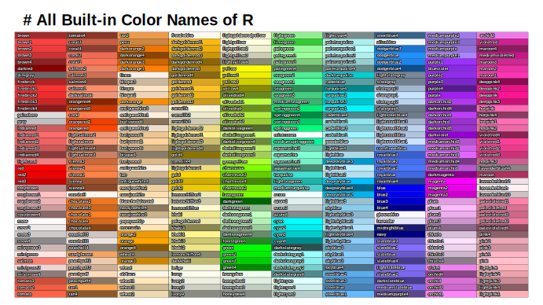
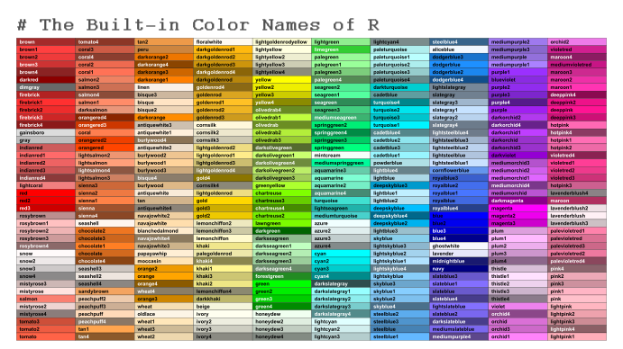

# R-color-cheatsheet
A simple script, which creates a cheatsheet of all built-in color names that R 
knows about. The resulting files can be found in the output folder in three
formats: `png`, `pdf` and `svg`.

## Cheatsheet with Outlined Labels
The first version of the cheatsheet uses outlined labels for a consistent style
with readability.

## Cheatsheet with Black and White Labels
An alternative version of the cheatsheet uses black and white labels depending
on the lightness of the color it is written onto. The style is less consistent
but in my opinion easier to read.

