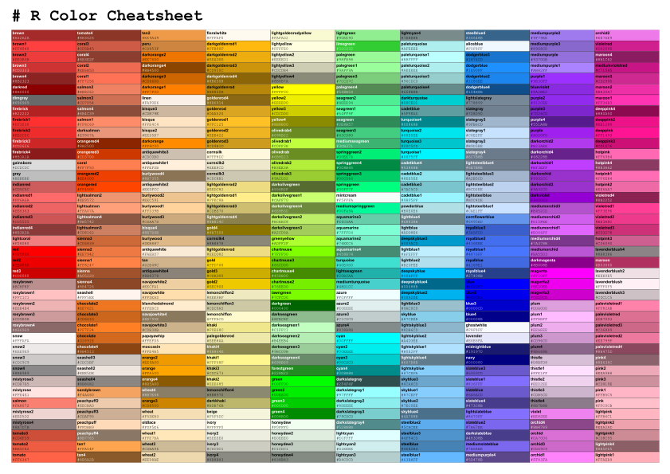

# A Cheatsheet for Standard Colors in R
Finding nice colors to optimize your R plots is a standard task for every data
scientist. I personally got tired of googling `"R color cheatsheet"` and settling 
with the incomplete or low quality versions I found there, so I made my own to
fit all of my needs. 

It is available in three high quality formats: `png` (600dpi), `svg` and `pdf`.

I created it with some data-wrangling of `colors()` and `ggplot`. Each tile
shows the name and hex value of the color. Colors are sorted by hue. The text
is written in either white or black depending on the brightness of the color.
I used its RGB distance to black and defined a cutoff for that.

There are two versions of the cheatsheet:

## Cheatsheet with Names and Hex Values
This main version includes names and hex values of each color on the left side of
each tile.

## Cheatsheet with large Labels
As the fontsize of each label was rather small, an alternative version of the 
cheatsheet includes centered labels only, but in larger font.

